# StarAI

StarAI 是一套 AI 聚合平台，可以把市面上优秀的大模型接入到同一个网站里，让用户在一个平台完成 AI 对话、推理问答、图片生成、视频生成、音频生成、智能体工作流和作品发布。

你可以用它搭建自己的 AI 工具站、AI 创作平台、模型聚合平台或企业内部 AI 助手平台。例如：生成商品图、商品视频、场景图、营销素材、短视频灵感、文案内容，或者把多个模型组合起来完成更复杂的创作任务。

## 能做什么

- 聚合大模型：统一接入对话、推理、图片、视频、音频等模型能力。
- AI 对话和推理：支持普通聊天、复杂问答、多模型协作和总结输出。
- 图片生成：可用于商品图、场景图、海报、封面、素材图等创作。
- 视频生成：可用于商品视频、场景视频、短视频素材和灵感内容。
- 智能体工作流：一键串联多个步骤，自动生成图片、视频或特定场景内容。
- 灵感广场：用户可以发布作品、浏览案例、复用提示词和模型配置。
- 用户和计费：内置登录、钱包、卡密充值、余额冻结、扣费和流水记录。
- 管理后台：可配置模型、价格、用户、任务、作品、公告、客服和系统信息。
- 开放 API：下游系统可以通过 OpenAI 风格接口调用平台内的模型能力。

## 技术栈

- 前台 / 后台：Next.js、React、TypeScript、Tailwind CSS
- 后端：Go、Gin、PostgreSQL、Redis
- 队列：Asynq、Redis
- 部署：Docker Compose

## 页面预览

### 前台页面

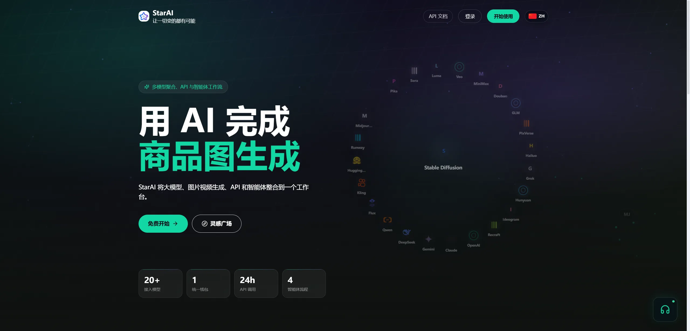

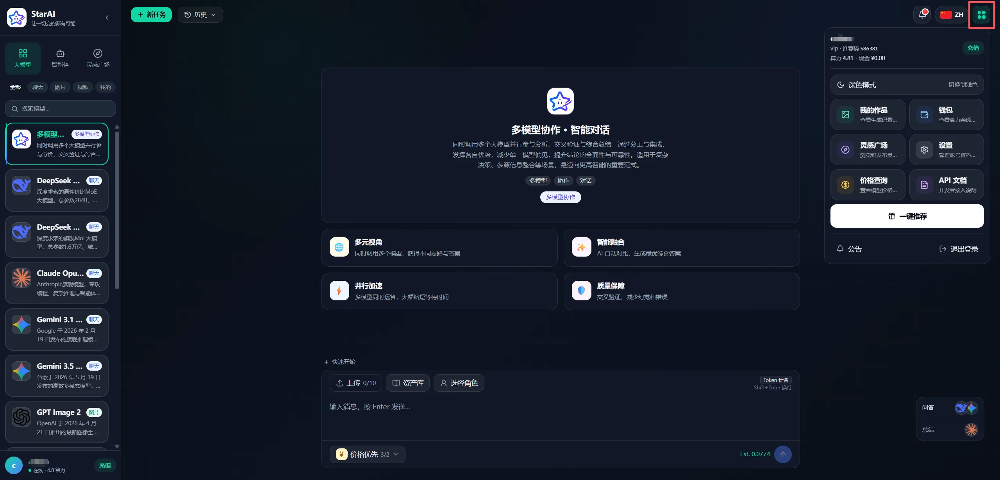

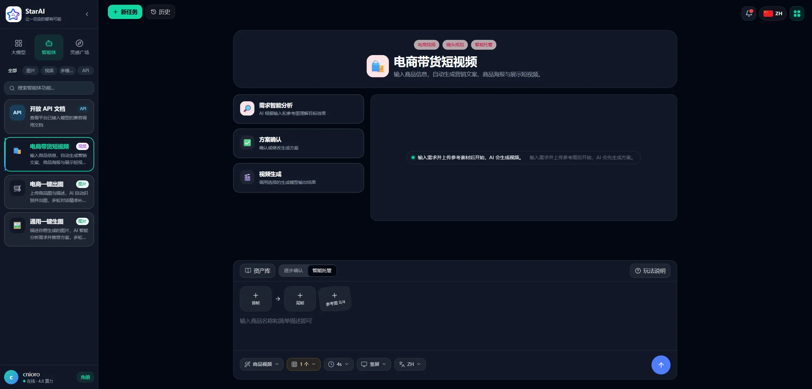

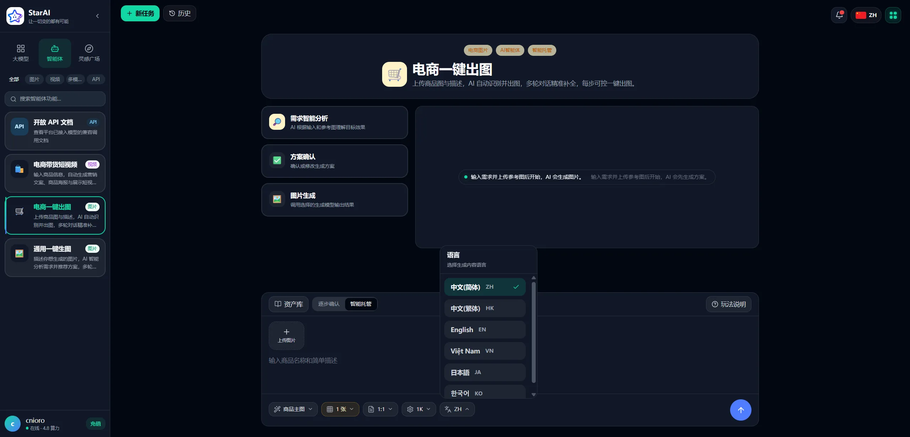

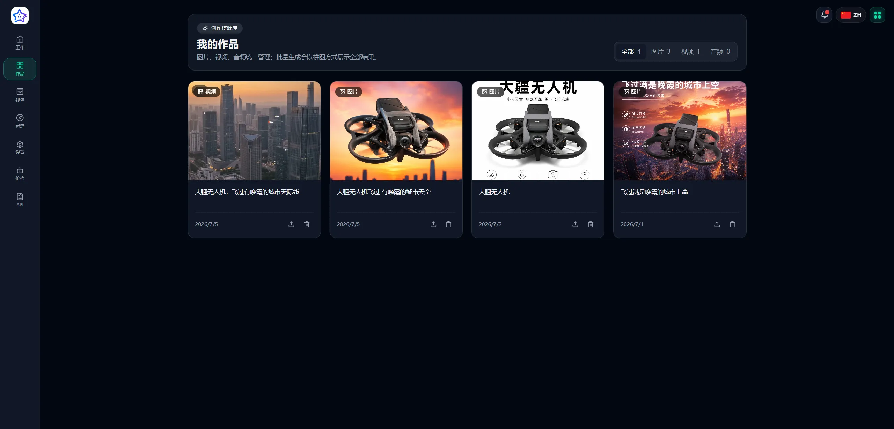

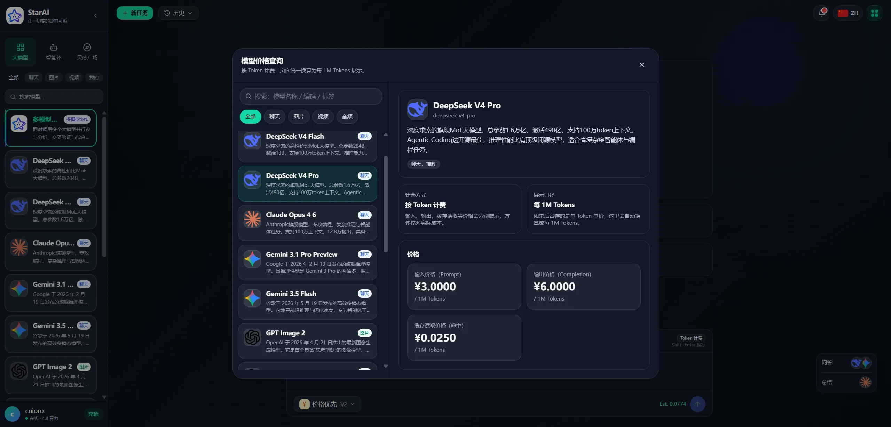

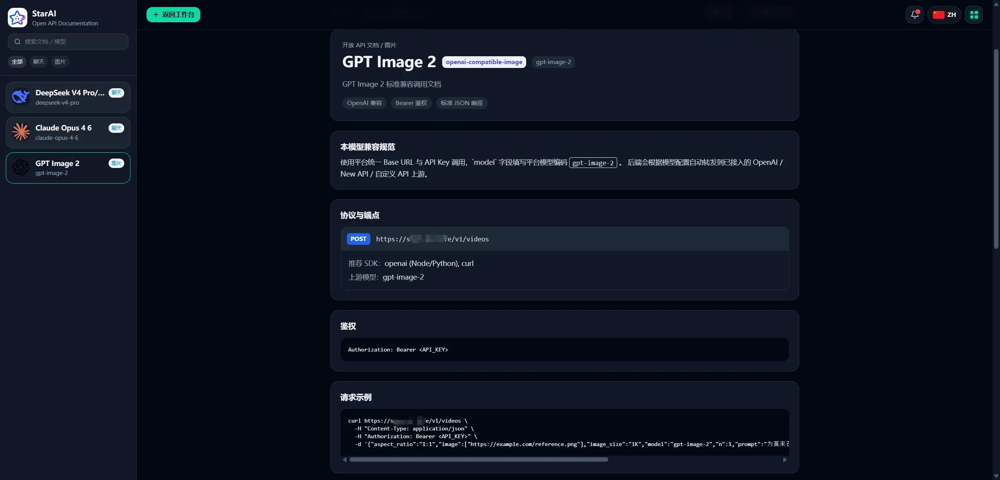

### 管理后台

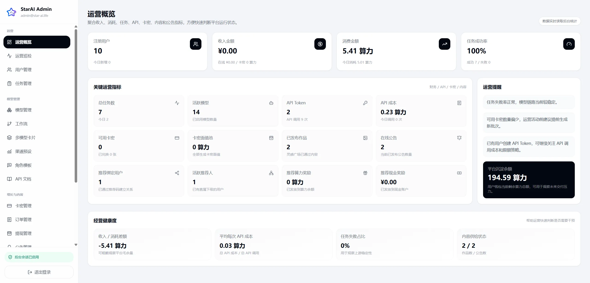

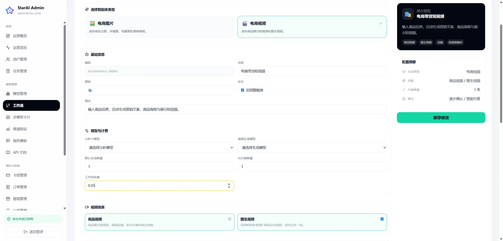

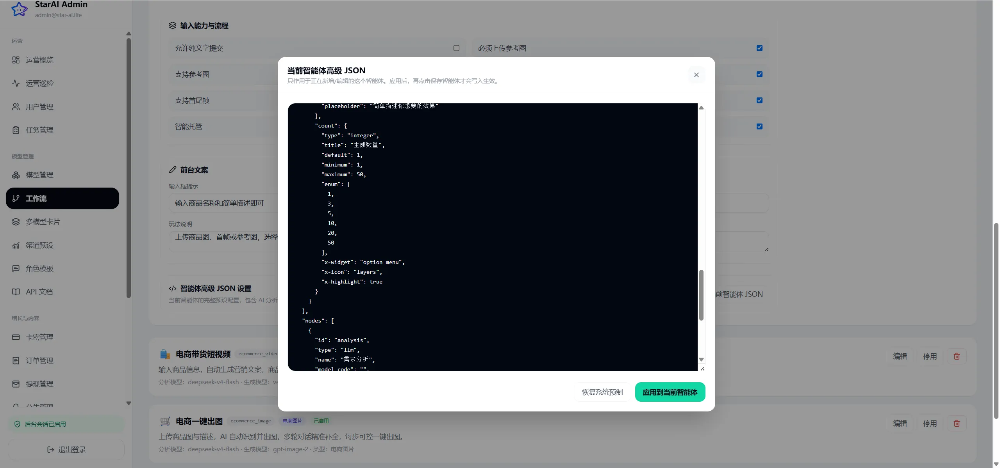

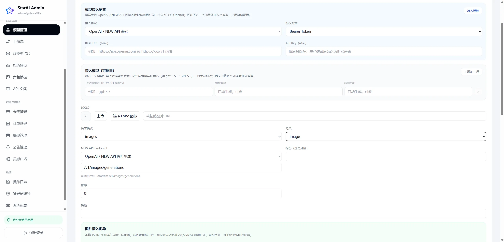

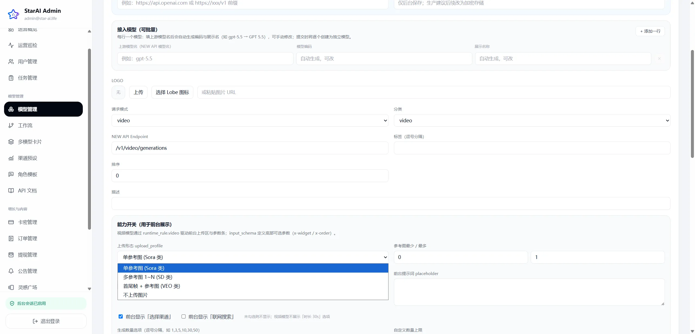


## 系统环境要求

本地开发建议使用：

| 环境 | 要求 |
|---|---|
| 操作系统 | Windows 10/11、macOS、Linux |
| Node.js | 20 或更高版本 |
| pnpm | 建议使用最新版 |
| Go | 1.25 或更高版本 |
| Docker | Docker Desktop 或 Docker Engine |
| Git | 用于拉取代码和版本管理 |

Windows 用户建议使用 PowerShell 运行脚本，并提前启动 Docker Desktop。

## 安装前置准备

本地启动前，请先确认：

- 已安装并启动 Docker。
- 已安装 Node.js 20+。
- 已安装 Go 1.25+。
- 已安装 Git。
- 当前目录可以正常执行 PowerShell 脚本。
- 端口 `3000`、`3001`、`3002`、`5432`、`6379`、`8080`、`9000`、`9001` 没有被其它程序占用。

如果还没有 pnpm，可以执行：

```bash
corepack enable
```

## 本地一键启动

Windows / PowerShell：

```powershell
powershell -NoProfile -ExecutionPolicy Bypass -File .\scripts\dev.ps1
```

脚本会自动完成：

- 创建 `.env`
- 启动 PostgreSQL、Redis、MinIO
- 执行数据库迁移
- 安装前端依赖
- 启动 API、Worker、Mock 模型网关、前台、后台

启动后访问：

| 服务 | 地址 |
|---|---|
| 前台 | http://localhost:3000 |
| 后台 | http://localhost:3001 |
| API | http://localhost:8080 |
| Mock 模型网关 | http://localhost:3002 |
| MinIO 控制台 | http://localhost:9001 |

默认开发账号：

| 类型 | 账号 |
|---|---|
| 管理员 | `admin@starai.local` / `admin123` |
| 测试用户 | `demo@starai.local` / `demo123` |
| 测试卡密 | `STARAI-DEMO-1000` |

> 生产环境必须修改默认账号密码和所有密钥。

## 手动开发启动

```bash
cp .env.example .env
pnpm install
make docker-up
make migrate-up
```

分别启动服务：

```bash
make dev-mock
make dev-api
make dev-worker
pnpm dev:web
pnpm dev:admin
```

## 生产环境一键部署

准备 `.env.production` 后执行：

```bash
bash scripts/deploy-prod.sh
```

常用方式：

```bash
# 只更新前台和后台
BUILD_SERVICES="web admin" RUN_MIGRATIONS=0 bash scripts/deploy-prod.sh

# 更新 API、Worker、前台、后台，并自动执行迁移
BUILD_SERVICES="api worker web admin" RUN_MIGRATIONS=auto bash scripts/deploy-prod.sh
```

生产环境建议使用 Nginx、Caddy、宝塔或云负载均衡反向代理，并配置 HTTPS。

单域名部署参考：

- [docs/deploy-single-domain-baota.md](docs/deploy-single-domain-baota.md)

## 常用文档

- [单域名 / 宝塔部署](docs/deploy-single-domain-baota.md)
- [完整备份与恢复](docs/full-backup-restore.md)
- [系统配置包导入导出](docs/settings-pack.md)
- [OpenAPI 文档](docs/api/openapi.yaml)

## 常用命令

```bash
# 构建
pnpm build:web
pnpm build:admin

# 后端测试
cd services/api && go test ./...

# Docker 磁盘清理
bash scripts/docker-disk-maintenance.sh
```

## 目录结构

```text
apps/
  web/                 前台用户端
  admin/               管理后台
services/
  api/                 Go API 服务
  worker/              异步任务 Worker
  mock-new-api/        本地 Mock 模型网关
infra/
  docker/              Docker Compose 配置
  migrations/          数据库迁移
scripts/               开发、部署、备份、维护脚本
docs/                  部署和运维文档
```

## 安全提醒

- 不要提交 `.env`、`.env.production`、数据库备份、真实 API Key、OAuth Secret、邮箱密钥。
- 模型供应商 API Key 只能保存在后端环境变量或后台安全配置中，不要写进前端代码。
- 管理后台上线后必须使用强密码，建议限制访问 IP 或增加网关鉴权。
- 正式开放注册前，请自行处理内容安全、频率限制、滥用防护和数据备份。
- 如启用在线支付，请先完成支付合规、回调验签、订单对账和退款异常处理。

## License

本项目采用 [MIT License](LICENSE) 开源，允许个人和商业用途。

使用本项目对接第三方 AI 模型、支付、邮箱、对象存储等服务时，请自行遵守对应服务商协议和当地法律法规。MIT License 不提供任何明示或暗示担保，生产环境使用前请自行完成安全、合规和风控审查。
