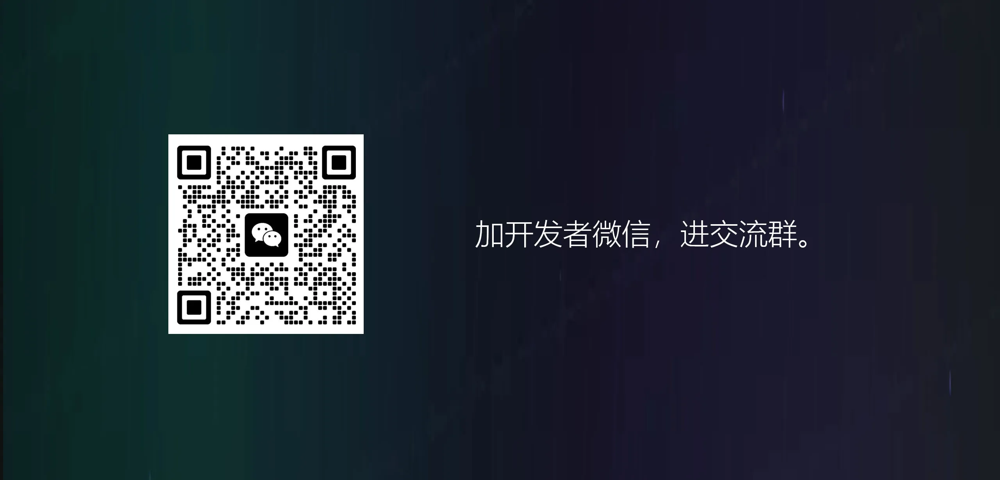

# StarAI

StarAI 是一套开源 AI 聚合平台，可把对话、推理、图片、视频、音频、智能体工作流和 OpenAI 兼容 API 聚合到同一个站点中。你可以用它搭建 AI 工具站、AI 创作平台、模型聚合平台或企业内部 AI 助手。

## 功能概览

- 多模型聚合：统一接入对话、推理、图片、视频、音频等模型能力。
- 前台工作台：支持模型选择、参数配置、素材上传、任务生成和作品管理。
- 智能体工作流：支持多步骤分析、确认、生成和自动化创作流程。
- 灵感广场：支持作品展示、案例浏览、提示词复用。
- 用户体系：登录注册、钱包余额、卡密充值、扣费流水。
- 管理后台：模型、渠道、用户、任务、作品、公告、角色模板、系统配置。
- 开放 API：提供 OpenAI 兼容接口，便于下游系统调用。

## 技术栈

| 模块 | 技术 |
| --- | --- |
| 前台 / 后台 | Next.js, React, TypeScript, Tailwind CSS |
| API | Go, Gin |
| 数据库 | PostgreSQL |
| 队列 | Redis, Asynq |
| 部署 | Docker Compose |

## 环境要求

本地开发建议：

| 环境 | 要求 |
| --- | --- |
| Node.js | 20+ |
| pnpm | 建议使用 Corepack |
| Go | 1.25+ |
| Docker | Docker Desktop 或 Docker Engine |
| Git | 用于拉取代码 |

Windows 用户建议使用 PowerShell，并提前启动 Docker Desktop。

## 环境变量模板

项目提供两份可提交模板：

| 文件 | 用途 |
| --- | --- |
| `.env.local` | 本地一键开发模板，使用 `localhost`、本地 PostgreSQL/Redis/MinIO/Mock 网关 |
| `.env.example` | 生产一键部署模板，使用 Docker Compose 内部主机名 `postgres`、`redis` 和单域名部署占位 |

本地开发：

```bash
cp .env.local .env
```

生产部署：

```bash
cp .env.example .env.production
```

生产环境必须修改 `.env.production` 里的域名、对象存储和模型网关配置。数据库密码和 JWT 密钥可以先使用模板默认值完成快速部署，但正式公开使用前建议改成随机强密码。

## 本地一键启动

Windows / PowerShell：

```powershell
powershell -NoProfile -ExecutionPolicy Bypass -File .\scripts\dev.ps1
```

脚本会自动：

1. 如果没有 `.env`，从 `.env.local` 创建。
2. 启动 PostgreSQL、Redis、MinIO。
3. 执行数据库迁移。
4. 安装前端依赖。
5. 启动 API、Worker、Mock 模型网关、前台和后台。

启动后访问：

| 服务 | 地址 |
| --- | --- |
| 前台 | http://localhost:3000 |
| 后台 | http://localhost:3001 |
| API | http://localhost:8080 |
| Mock 模型网关 | http://localhost:3002 |
| MinIO 控制台 | http://localhost:9001 |

默认开发账号：

| 类型 | 账号 |
| --- | --- |
| 管理员 | `admin@starai.local` / `admin123` |
| 测试用户 | `demo@starai.local` / `demo123` |
| 测试卡密 | `STARAI-DEMO-1000` |

生产环境上线后必须修改默认账号密码和所有密钥。

## 手动本地启动

```bash
cp .env.local .env
pnpm install
make docker-up
make migrate-up
```

分别启动服务：

```bash
make dev-mock
make dev-api
make dev-worker
pnpm dev:web
pnpm dev:admin
```

## 生产部署

单域名宝塔部署推荐：

```bash
cp .env.example .env.production
# edit .env.production
bash scripts/deploy-prod.sh
```

部署脚本会校验生产环境变量。如果 `APP_ENV=production` 但仍使用 `localhost` 或 `yourdomain.com`，脚本会停止，避免构建出错误的前端包。数据库密码和 JWT 密钥使用模板默认值时只会提示警告，不会阻断部署。

常用更新命令：

```bash
# 更新全部服务
bash scripts/deploy-prod.sh

# 只更新前台和后台
BUILD_SERVICES="web admin" bash scripts/deploy-prod.sh

# 只更新 API 和 Worker
BUILD_SERVICES="api worker" bash scripts/deploy-prod.sh

# 前端地址或代码异常时，无缓存重建
NO_CACHE_SERVICES="web admin" BUILD_SERVICES="web admin" bash scripts/deploy-prod.sh
```

详细部署教程：

- [宝塔面板单域名部署教程](docs/deploy-single-domain-baota.md)
- [完整备份与恢复](docs/full-backup-restore.md)
- [系统配置包导入导出](docs/settings-pack.md)

## 页面预览

### 前台


### 管理后台


### 联系交流




## 常用命令

```bash
# 前端构建
pnpm build:web
pnpm build:admin

# API 测试
cd services/api && go test ./...

# Worker 测试
cd services/worker && go test ./cmd/worker

# Docker 磁盘报告
bash scripts/docker-disk-maintenance.sh report

# Docker 安全清理
bash scripts/docker-disk-maintenance.sh safe-clean
```

## 目录结构

```text
apps/
  web/                 用户前台
  admin/               管理后台
services/
  api/                 Go API 服务
  worker/              异步任务 Worker
  mock-new-api/        本地 Mock 模型网关
infra/
  docker/              Docker Compose 配置
  migrations/          数据库迁移
scripts/               开发、部署、备份、维护脚本
docs/                  部署和运维文档
```

## 安全提醒

- 不要提交 `.env`、`.env.production`、数据库备份、配置包、真实 API Key、OAuth Secret、邮箱密钥。
- 公开仓库前建议执行数据脱敏脚本，清理真实域名、邮箱、模型密钥、任务记录和用户业务数据。
- 模型供应商 API Key 只能保存在后端环境变量或后台安全配置中，不要写进前端代码。
- 管理后台上线后必须使用强密码，建议限制访问 IP 或增加网关鉴权。公开生产环境建议修改默认数据库密码、`JWT_SECRET` 和 `ADMIN_JWT_SECRET`。
- 正式开放注册前，请自行处理内容安全、频率限制、滥用防护和数据备份。
- 启用在线支付前，请先完成支付合规、回调验签、订单对账和退款异常处理。

## License

本项目采用 [MIT License](LICENSE) 开源。

使用本项目对接第三方 AI 模型、支付、邮箱、对象存储等服务时，请自行遵守对应服务商协议和当地法律法规。MIT License 不提供任何明示或暗示担保，生产环境使用前请自行完成安全、合规和风控审查。
